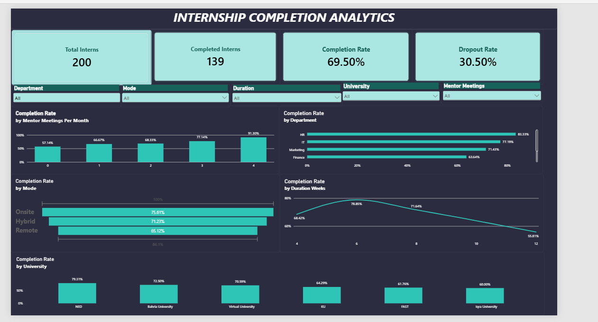

# Internship Completion Rate Analysis

First task for my Data Analytics Internship at Internee.pk. The goal was to analyze internship completion rates and identify what factors are associated with interns finishing their programs versus dropping out.

## Objective

Analyze and visualize internship completion rates to identify key success factors, based on enrollment, completion, and dropout data across department, duration, and mentor interaction.

## Dataset

A sample dataset of 200 interns covering department, university, work mode, program duration, mentor meetings per month, and completion status.

## Tools Used

- **Excel** — data cleaning, PivotTables, and charts to explore completion rate by department, duration, mentor meetings, mode, and university
- **Power BI** — interactive dashboard with KPI cards, slicers, DAX measures, and a custom color theme

## Key Findings

- Overall completion rate: 69.50% (139 completed out of 200 interns)
- Mentor interaction showed the strongest association with completion — rates rose from 57.14% (no mentor meetings) to 91.30% (4 meetings/month)
- 6-week internships had the highest completion rate (78.85%); 12-week internships had the lowest (55.81%)
- Onsite (75.61%) and hybrid (71.23%) interns completed at higher rates than remote interns (65.12%)
- HR (83.33%) and IT (77.19%) departments had the highest completion rates

## Files in This Repo

- `internship_completion_data.xlsx` — cleaned dataset, PivotTables, and written insights
- `internship_dashboard.pbix` — Power BI dashboard file
- 

## Author

Iqra Mehmood — BS Data Science student, Virtual University of Pakistan
